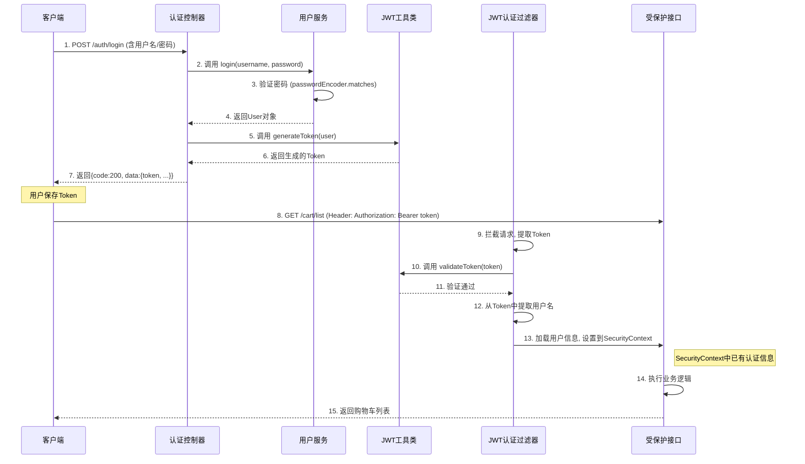

# -my-project-图书商城系统
项目自存


# 图书商城说明文档


---

## 1. 项目概述

### 1.1. 开发目的
本项目旨在设计并实现一个功能完备的“网上书城”后端系统，以满足移动端App的核心业务需求。开发目的严格遵循作业要求，主要在于：
1.  **检验对SpringBoot框架的掌握程度**: 深入应用Spring Boot进行快速、高效的后端开发。
2.  **检验对SpringSecurity的二次开发能力**: 基于JWT（JSON Web Token）实现无状态认证与授权，保护后端接口安全。
3.  **检验根据需求进行系统二次开发的能力**: 实现作业要求中的所有基础功能和提高功能，如订单系统和头像上传。
4.  **检验与前端进行协调开发的能力**: 设计清晰、规范的RESTful API，提供统一的数据响应格式，便于前后端分离开发模式下的高效协作。

### 1.2. 技术栈
*   **核心框架**: Spring Boot 3.x
*   **安全框架**: Spring Security
*   **持久层框架**: MyBatis
*   **数据库**: **SQLite** (为满足 `java -jar` 独立运行的要求)
*   **认证方案**: JSON Web Token (JWT)
*   **开发工具**: Gradle, IntelliJ IDEA

## 2. 系统设计

### 2.1. 数据库设计

本项目的数据库设计围绕网上书城的核心业务展开，主要包括用户、商品、订单、购物车、地址、收藏、评价等模块。根据项目中的实体类（Entity）和数据访问层接口（Mapper），可以推断出以下核心数据表结构：

1.  **`user` (用户表)**
    *   `id`: 用户ID (主键)
    *   `username`: 用户名 (唯一)
    *   `password`: 加密后的密码
    *   `privilege`: 权限 (例如, 0=普通用户, 1=管理员)
    *   `avatar`: 用户头像URL

2.  **`book` (书籍商品表)**
    *   `id`: 书籍ID (主键)
    *   `name`: 书名
    *   `author`: 作者
    *   `price`: 价格
    *   `img`: 封面图片URL
    *   `description`: 描述
    *   `category`: 分类ID (外键, 关联 `category` 表)

3.  **`category` (分类表)**
    *   `id`: 分类ID (主键)
    *   `name`: 分类名称

4.  **`cart` (购物车表)**
    *   `id`: 购物车项ID (主键)
    *   `user_id`: 用户ID (外键)
    *   `book_id`: 书籍ID (外键)
    *   `quantity`: 数量

5.  **`orders` (订单表)**
    *   `id`: 订单ID (主键)
    *   `user_id`: 用户ID (外键)
    *   `order_sn`: 订单号 (唯一业务ID)
    *   `total_price`: 订单总价
    *   `status`: 订单状态 (例如, 0=待支付, 1=待发货, 2=待收货, 3=已完成)
    *   `address_id`: 收货地址ID (外键)
    *   `create_time`, `pay_time`, `ship_time`, `receive_time`: 各阶段时间戳

6.  **`order_item` (订单项表)**
    *   `id`: 订单项ID (主键)
    *   `order_id`: 订单ID (外键)
    *   `book_id`: 书籍ID (外键)
    *   `name`, `cover`, `price`, `quantity`: 商品快照信息

7.  **`address` (收货地址表)**
    *   `id`: 地址ID (主键)
    *   `user_id`: 用户ID (外键)
    *   `name`, `phone`, `province`, `city`, `district`, `detail`: 收货人详细信息
    *   `is_default`: 是否为默认地址

8.  **`favor` (收藏表)**
    *   `id`: 收藏记录ID (主键)
    *   `user_id`: 用户ID (外键)
    *   `book_id`: 书籍ID (外键)

9.  **`review` (评价表)**
    *   `id`: 评价ID (主键)
    *   `order_id`, `book_id`, `user_id`: 关联ID
    *   `rating`: 评分
    *   `content`: 评价内容
    *   `create_time`: 创建时间

**实体关系说明：**
*   一个`用户`可以有多个`订单`、多个`地址`、多个`购物车项`、多个`收藏`和多个`评价`。
*   一个`订单`包含多个`订单项`。
*   一个`书籍`属于一个`分类`。

> 
### 2.2. 项目架构

本项目采用经典且成熟的三层架构模型，并结合Spring Boot的最佳实践，实现了高度模块化和前后端分离的设计。

**架构图:**
```mermaid
graph TD
    A[客户端/浏览器] --> B{Controller 层 (API接口)};
    B --> C{Service 层 (业务逻辑)};
    C --> D{Mapper/DAO 层 (数据访问)};
    D -- MyBatis --> E[数据库 (Database)];

    subgraph "后端应用 (Spring Boot)"
        B; C; D;
        F[配置层 (Configuration)] -.-> B;
        F -.-> C;
        F -.-> D;
        G[过滤器/处理器 (Filter/Handler)] -- 拦截请求 --> B;
        H[工具类 (Utils)] -.-> C;
        H -.-> B;
        I[DTO/Entity] -- 数据传输 --> B;
        I -- 数据传输 --> C;
        I -- 数据传输 --> D;
    end
```

**各模块作用说明:**

*   **Controller 层 (接口层)**:
    *   **作用**: 作为应用的入口，是与前端直接交互的门面。它负责接收和解析客户端的HTTP请求，对请求参数进行初步校验，然后将处理任务分派给相应的Service层。处理完成后，它会将Service返回的数据封装成统一的JSON格式（通过`ApiResponse`类）响应给前端。
    *   **示例**: `AuthController`, `BookController`, `OrderController` 等。它们使用 `@RestController` 和 `@RequestMapping` 等注解定义了所有对外暴露的RESTful API端点。

*   **Service 层 (业务逻辑层)**:
    *   **作用**: 项目的业务核心，负责实现所有具体的业务功能。它编排一个或多个Mapper进行数据操作，处理复杂的业务规则（如计算、校验、状态流转），并利用Spring的`@Transactional`注解来管理数据库事务，保证数据的一致性。
    *   **示例**: `UserService` 负责用户登录、注册的逻辑；`OrderService` 负责创建订单、更新状态等复杂的业务流程；`CustomUserDetailsService` 为Spring Security提供根据用户名加载用户详情的特定服务。

*   **Mapper/DAO 层 (数据访问层)**:
    *   **作用**: 定义了与数据库直接交互的接口，是数据持久化的唯一通道。本项目使用MyBatis框架，通过`@Mapper`注解和SQL语句（直接写在注解或XML中）实现对数据库的增、删、改、查（CRUD）操作，将数据库操作与业务逻辑彻底解耦。
    *   **示例**: `UserMapper`, `BookMapper`, `OrderMapper` 等，每个Mapper接口的方法都对应一条具体的SQL操作。

*   **Entity 层 (实体层)**:
    *   **作用**: 定义与数据库表结构一一对应的Java对象（POJO），是数据在程序内部的基本载体。
    *   **示例**: `User`, `Book`, `Order` 等，它们的字段直接映射到数据库表的列。

*   **DTO 层 (数据传输对象层)**:
    *   **作用**: 用于在不同层之间，特别是Controller和前端之间传输数据。它的设计是为了满足特定场景的数据需求，可以对数据进行封装、裁剪或聚合，避免将包含敏感信息或不必要字段的`Entity`直接暴露给前端。
    *   **示例**: `LoginRequest`封装登录参数；`PageResult`封装分页查询结果；`OrderDetailResponse`聚合了订单和地址信息，专用于订单详情接口。

*   **Configuration/Filter/Handler/Util (支撑模块)**:
    *   **作用**: 这些模块提供了项目运行所需的基础支持和横切功能。
    *   **Configuration**: 配置类，如`SecurityConfig`用于集中配置Spring Security安全策略，`WebConfig`用于配置CORS和静态资源映射。
    *   **Filter/Handler**: 过滤器和处理器，如`JwtAuthenticationFilter`在请求到达Controller前进行JWT认证，`GlobalExceptionHandler`使用AOP思想捕获全局异常并提供统一响应。
    *   **Util**: 工具类，如`JwtUtil`封装了JWT的生成和验证算法，供多处复用。

### 2.3. 详细设计过程

此处选择 **"用户登录认证与接口访问"** 这一核心流程进行详细说明，因为它贯穿了项目的多个关键模块，完整地展现了系统是如何设计和实现安全访问控制的。

**设计过程是如何设计的：**
本流程的设计目标是实现一个**无状态、基于Token**的认证系统，这非常适合前后端分离的现代Web应用。设计思路如下：
1.  **放弃Session**: 传统的基于Session的认证是有状态的，不便于水平扩展。因此，我们选择JWT，服务器无需保存用户状态，每次请求都自带身份信息。
2.  **职责分离**: 将认证流程拆分为几个独立的组件：`SecurityConfig`负责宏观策略，`AuthController`负责登录颁发Token，`JwtUtil`负责Token的算法实现，`JwtAuthenticationFilter`负责在每次请求中验证Token。这种设计遵循单一职责原则，使代码更清晰、易维护。
3.  **与Spring Security整合**: 不重新发明轮子，而是将自定义的JWT逻辑无缝集成到Spring Security强大的过滤链中。通过`addFilterBefore`将我们的JWT过滤器置于合适的位置，利用Spring Security的上下文（`SecurityContextHolder`）来管理认证状态。

**流程图:**


**设计步骤与代码说明:**

1.  **配置安全策略 (`SecurityConfig.java`)**:
    设计的第一步是在`SecurityConfig`中定义全局的安全规则。我们使用`authorizeHttpRequests`方法来精细化控制每个URL的访问权限。`requestMatchers(...).permitAll()`用于声明公开接口（如登录、注册、浏览书籍），任何人都可以访问。`anyRequest().authenticated()`则规定了所有其他未明确声明的接口都必须经过认证。最后，通过`addFilterBefore`将我们自定义的`JwtAuthenticationFilter`置于Spring Security过滤链中关键的`UsernamePasswordAuthenticationFilter`之前，确保在检查用户名密码前先检查JWT。
    ```java
    // SecurityConfig.java
    @Bean
    public SecurityFilterChain filterChain(HttpSecurity http) throws Exception {
        http
            // ... 其他配置 ...
            .authorizeHttpRequests(authz -> authz
                    // 公开接口 - 不需要认证
                    .requestMatchers("/auth/login", "/auth/register", "/book/**").permitAll()
                    // 其他所有请求都需要认证
                    .anyRequest().authenticated()
            )
            // 在UsernamePasswordAuthenticationFilter前添加我们自定义的JWT过滤器
            .addFilterBefore(jwtAuthenticationFilter, UsernamePasswordAuthenticationFilter.class);

        return http.build();
    }
    ```

2.  **用户登录与Token颁发 (`AuthController.java`, `UserService.java`, `JwtUtil.java`)**:
    用户通过 `/auth/login` 接口提交用户名和密码。`AuthController` 将请求体`LoginRequest` 交给 `UserService` 处理。`UserService` 从数据库查询用户，并使用`PasswordEncoder`来安全地比对前端传来的明文密码和数据库中存储的哈希密码。验证成功后，返回完整的`User`对象给`Controller`。`Controller`随即调用`JwtUtil`，传入用户ID、用户名、权限等关键信息，生成一个有时效性的JWT返回给客户端。
    ```java
    // UserService.java
    public User login(String username, String password) {
        User user = userMapper.findByUsername(username);
        if (user == null) {
            throw new RuntimeException("用户不存在");
        }
        // 使用BCrypt比对密码，防止时序攻击
        if (!passwordEncoder.matches(password, user.getPassword())) {
            throw new RuntimeException("密码错误");
        }
        return user;
    }
    
    // AuthController.java
    public ApiResponse<LoginResponse> login(@RequestBody LoginRequest loginRequest) {
        // ...
        User user = userService.login(loginRequest.getUsername(), loginRequest.getPassword());
        String token = jwtUtil.generateToken(user.getUsername(), user.getId(), user.getPrivilege());
        // ...
    }
    ```

3.  **请求拦截与Token验证 (`JwtAuthenticationFilter.java`)**:
    这是保障后续所有受保护接口安全的核心。当客户端携带Token访问任意接口时，`JwtAuthenticationFilter` 会被触发。它首先检查请求头中是否存在`Authorization: Bearer ...`格式的Token。如果存在，它会：
    *   **提取和解析**: 从请求头中提取出纯净的Token字符串。
    *   **验证**: 调用`JwtUtil.validateToken()`方法，该方法会检查Token的签名是否正确（未被篡改）以及Token是否已过期。
    *   **设置安全上下文**: 如果Token验证通过，过滤器会从Token中解析出用户名，然后通过`UserDetailsService`从数据库加载该用户的详细信息（特别是权限）。最后，它会创建一个`UsernamePasswordAuthenticationToken`对象，并将其设置到`SecurityContextHolder.getContext().setAuthentication(...)`中。这个操作相当于告知Spring Security：“这位用户已经合法登录了，这是他的身份和权限”。
        此后，请求才会继续流转到`Controller`。`Controller`内部以及更深层的`Service`就可以通过安全上下文获取当前用户信息，或依靠Spring Security的注解（如`@PreAuthorize`）进行更细粒度的权限控制。
    ```java
    // JwtAuthenticationFilter.java
    @Override
    protected void doFilterInternal(HttpServletRequest request, ...) {
        final String authHeader = request.getHeader("Authorization");
        // ...
        final String token = authHeader.substring(7);
        final String username = jwtUtil.extractUsername(token);

        // 如果Token有效，且当前SecurityContext中没有认证信息
        if (username != null && SecurityContextHolder.getContext().getAuthentication() == null) {
            UserDetails userDetails = userDetailsService.loadUserByUsername(username);

            if (jwtUtil.validateToken(token, userDetails.getUsername())) {
                UsernamePasswordAuthenticationToken authToken =
                        new UsernamePasswordAuthenticationToken(userDetails, null, userDetails.getAuthorities());
                authToken.setDetails(new WebAuthenticationDetailsSource().buildDetails(request));
                // 核心步骤：将认证信息设置到安全上下文中
                SecurityContextHolder.getContext().setAuthentication(authToken);
            }
        }
        filterChain.doFilter(request, response);
    }
    ```


## 4. 功能实现

本章节将严格按照作业要求，逐一阐述各项功能的后端实现方案。

#### 4.1. 基础功能 (80分部分)

##### 4.1.1. 书籍浏览与搜索
*   **需求1：根据类别筛选书籍列表**
    *   **后端实现**: 为实现此功能，系统提供了两个核心API。首先，`GET /category/list`接口由`CategoryController`处理，它调用`BookService`进而访问`CategoryMapper`中的`findAll()`方法，查询并返回所有书籍分类的列表，供前端作为筛选选项。其次，`GET /book/list-category?categoryId={id}`接口由`BookController`处理，它接收前端传递的`categoryId`，通过`BookService`调用`BookMapper`中的`findByCategoryId`方法，执行精确的SQL查询，筛选出属于该特定分类的所有书籍并返回给前端展示。

*   **需求2：对书名和作者进行搜索**
    *   **后端实现**: 系统通过`GET /book/list-keyword?keyword={text}`接口实现搜索功能。`BookController`接收到请求后，调用`BookService`的`getBooksByKeyword()`方法。该方法最终委托给`BookMapper`的`findByKeyword()`方法，其内部使用了MyBatis的动态SQL，通过`'%' || #{keyword} || '%'`的语法拼接SQL语句，实现了对`book`表的`name`（书名）和`author`（作者）两个字段同时进行模糊查询（`LIKE`操作），并将匹配的结果集返回。

##### 4.1.2. 登录与认证
*   **需求1：提供登录接口，保存登录状态**
    *   **后端实现**: 系统提供了`POST /auth/login`接口来处理用户登录。`AuthController`接收包含用户名和密码的请求体，并调用`UserService`进行验证。`UserService`会使用Spring Security的`PasswordEncoder`将用户传入的明文密码与数据库中存储的加密哈希值进行安全比对。验证成功后，`AuthController`会调用`JwtUtil`工具类，根据用户的ID、用户名和权限等级（privilege）生成一个JWT（JSON Web Token）。这个Token被返回给前端。所谓的“保存登录状态”，实际上是由前端负责将此Token存储起来（例如，在浏览器的LocalStorage中），并在后续所有需要认证的请求的`Authorization`头中以`Bearer <token>`的形式携带它。后端本身是无状态的。

*   **需求2：个人信息、购物车等功能需要处于登录状态**
    *   **后端实现**: 这一强制要求是通过Spring Security的安全配置和自定义过滤器实现的。在`SecurityConfig`中，像`/profile/**`、`/cart/**`、`/order/**`等路径被配置为`.authenticated()`，即必须通过认证才能访问。`JwtAuthenticationFilter`作为安全守卫，会拦截所有向这些路径发起的请求。它会从请求头中提取JWT，并使用`JwtUtil`来验证其签名和是否过期。如果Token有效，过滤器会从中解析出用户信息，并通过`CustomUserDetailsService`加载完整的用户权限，最后在`SecurityContextHolder`中设置认证信息。如果请求没有携带Token或Token无效，过滤器将中断请求，并由认证入口点`AuthEntryPointJwt`返回401未授权的错误响应，从而强制要求用户必须处于登录状态。

##### 4.1.3. 购物车功能
*   **需求1：购物车数据存放于后端，可增减**
    *   **后端实现**: 用户的购物车数据被持久化在后端的`cart`数据库表中，与`user_id`关联，确保了数据的持久性和用户隔离性。系统提供了一系列RESTful API来操作购物车：
        *   `POST /cart/add`: 当用户添加商品时，`CartService`会先检查该商品是否已存在于用户的购物车中。若存在，则增加其`quantity`（数量）；若不存在，则插入一条新的记录。
        *   `POST /cart/update`: 允许用户修改购物车中已存在商品的数量。
        *   `POST /cart/remove`: 接收一个或多个购物车项ID的列表，并执行批量删除操作，同时会校验操作者是否为该购物车项的所有者。
            这些接口都设计为通过AJAX调用，为前端实现流畅的交互体验提供了支持。

##### 4.1.4. 个人信息
*   **需求1 & 2：查看购物订单或收藏的信息**
    *   **后端实现**: 为满足此需求，系统提供了两个受保护的API：
        *   `GET /order/list`: `OrderController`处理此请求。它从安全上下文中获取当前登录用户的ID，然后调用`OrderService`来查询该用户的所有订单记录。为提供完整信息，服务层还会一并查询每个订单下的所有订单项（`order_item`）。
        *   `GET /favorite/list`: `FavoriteController`调用`FavoriteService`。服务层通过`FavoriteMapper`执行一个`JOIN`查询，关联`favor`表和`book`表，从而获取用户收藏的所有书籍的完整信息列表。这两个接口都强制要求用户必须登录。

#### 4.2. 提高功能 (20分部分)

##### 4.2.1. 购物订单
*   **需求1：对购物车的商品合并生成订单**
    *   **后端实现**: 此核心功能由`POST /order/create`接口提供。`OrderService`中的`createOrder`方法是整个流程的关键，它被`@Transactional`注解标记，以确保操作的原子性。当接收到请求（包含购物车项ID列表和地址ID）后，该方法在一个数据库事务内按顺序执行以下步骤：
        1.  **校验**: 验证传入的购物车项和地址ID是否有效且属于当前登录用户。
        2.  **计算**: 遍历商品，累加计算出订单总价。
        3.  **创建主订单**: 生成一个唯一的订单号（`order_sn`），并将订单主体信息插入到`orders`表中。
        4.  **创建订单项**: 将购物车中的商品信息作为“快照”批量插入到`order_item`表中。
        5.  **清空购物车**: 从`cart`表中删除已经下单的商品。
            如果上述任何一步失败，整个事务将自动回滚，数据库状态恢复到操作之前，从而杜绝了数据不一致的风险。

*   **需求2：对订单进行查看和管理**
    *   **后端实现**:
        *   **查看**: 提供了`GET /order/detail/{orderId}`接口。`OrderService`会根据订单ID查询订单主信息、关联的订单项列表以及配送地址信息，然后将这些数据聚合到一个`OrderDetailResponse` DTO中返回，为前端提供一站式的订单详情数据。
        *   **管理**: 订单的管理主要体现在状态的流转上。系统提供了如`POST /order/pay`（支付）、`POST /order/receive`（确认收货）等接口。`OrderService`中的相应方法会首先检查订单当前状态是否满足操作的前提条件（例如，只有“待收货”状态的订单才能被“确认收货”），检查通过后，再更新`orders`表中的`status`字段，并记录下相应的时间戳（如`pay_time`、`receive_time`）。

##### 4.2.2. 个人信息MKII
*   **需求1：增加用户信息浏览**
    *   **后端实现**: 这是一个典型的**管理员权限**功能。访问控制通过Spring Security的基于角色的授权机制实现。在`SecurityConfig`中，`/admin/**`路径被配置为只对拥有`ADMIN`角色的用户开放。`CustomUserDetailsService`在加载用户时，会根据数据库中的`privilege`字段（例如，`1`代表管理员）为用户赋予`ROLE_ADMIN`权限。`UserController`中的`GET /admin/user/page`接口接收分页和查询参数，调用`UserService`来执行对`user`表的分页查询，从而实现了管理员浏览和管理所有用户的功能。

*   **需求2：增加头像设置等功能**
    *   **后端实现**: 此功能采用了**Base64编码方案**进行图片上传，属于**课程上没有教授的技术**的应用，展现了对现代Web开发技术的掌握。
        1.  **API定义**: `ProfileController`提供`POST /profile/avatar`接口，接收一个包含Base64编码字符串的JSON对象。
        2.  **业务逻辑 (`ProfileService`)**: 服务层接收到Base64字符串后，首先会解析并去除数据URI头部（如`data:image/png;base64,`），然后使用`java.util.Base64.getDecoder()`将其解码为原始的图片字节数组`byte[]`。接着，系统使用UUID生成一个唯一的文件名以防止冲突，并将字节数组写入到服务器的指定目录中（该目录由`application.properties`中的`file.upload-dir`属性配置）。
        3.  **数据更新与资源服务**: 文件保存成功后，系统会构建一个可供外部访问的URL（如`/uploads/uuid-generated-name.png`）并将其更新到当前用户的`avatar`字段中。为了让这个URL能被浏览器访问，`WebConfig`中配置了一个资源处理器，将`/uploads/**`的URL路径映射到服务器上的物理文件存储目录，从而使上传的头像可以被正常显示。

## 5.完成时间
本项目的主要编码工作花费了大约一周的课余时间。

## 6.意见和建议
希望课程能多一些关于项目部署（如Docker）或缓存技术（如Redis）的介绍，以便让项目更完整。

